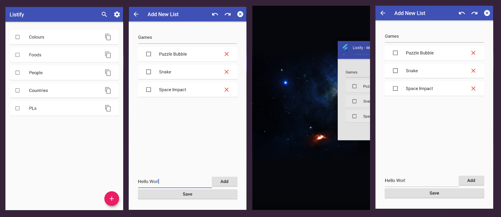
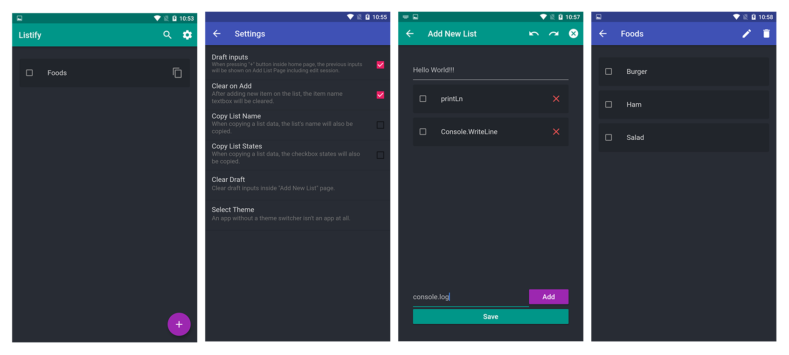

  

A super powerful flutter state management library inspired with MVC pattern with a very flexible dependency injection.

---

## Features
  - Very flexible `Dependency Injection` to easily instantiate any dependencies once and reuse multiple times across the app.
  - `Persistence` support for states and routing. Use any storage provider.
  - Time travel (`undo/redo`) support in one line of code out of the box.
  - Optional `Equatable` support. (*Improves time travel*).
  - `Immutable` states/models. There's only one way to rebuild a widget.
  - You can `reset a state` or all of the states.
  - `Skip rebuilds`. Widget specific.
  - Easy to use `Event System` for sending events to the widgets. *For showing dialogs/snackbars/alerts/navigation/etc.*
  - Momentum doesn't have any dependencies so it increases compatibility in other platforms.
  - Supports older versions of flutter.

## Core Concepts

  - Momentum only uses `setState(...)` under the hood.
  - The method `model.update(...)` is the setState of momentum.
  - Modular project structure because of the component system (`MomentumController` + `MomentumModel`).
  - Everything can be reusable from widgets, services, data, state to logic.
  - Everything is in the widget tree.

## Preview
In this image the process was like this:
- Open the app (Home Page).
- Go to *Add New List* page.
- Input some data.
- Close and Terminate on task view.
- Reopen the app again.

And magic happens! All the inputs were retained and not just that but also including the page where you left off. Navigation history is also persisted which means pressing the system back button will navigate you to the correct previous page.

#### Dark Mode
This theming is done manually using momentum.

#### [Source Code for this Example App](https://github.com/xamantra/listify)
This example app shows how powerful momentum is.