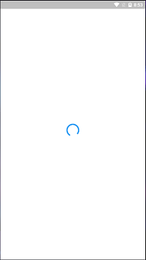
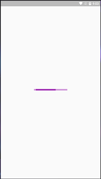

# Initialize App
Have you ever wanted to load some big data before your app actually starts? That's where `bootstrapAsync()` comes in.

- With `bootstrapAsync()`, you can load something asynchronously before your app starts.
- Momentum will show a default loading widget but you can override it with a custom one. 

The guide below will use a scenario where the app needs to load all employees in the company when the app starts.

## Configure Lazy Loading
The first requirement for this is to disable lazy loading. We want our controller to load when the app starts.

```dart
void main() {
  runApp(
    Momentum(
      child: MyApp(),
      controllers: [
        // ...
        CompanyController()..config(lazy: false),
        // ...
      ],
      // ...
    ),
  );
}
```

<hr>

## Override bootstrapAsync()
The next step is to override the virtual method `bootstrapAsync()`.

```dart
class CompanyController extends MomentumController<CompanyModel> {

  // ...

  Future<void> bootstrapAsync() async {
    var apiService = getService<ApiService>();
    var employeeList = await apiService.getEmployeeList();
    model.update(employeeList: employeeList);
  }

  // ...
}
```

- Imagine if `await apiService.getEmployeeList()` will take seconds to finish.
- Momentum will await this and show a loading widget.
- When the async code finishes, `MyApp()` will now show.

This is how the default loading widget looks like:



That's it, only two steps! The additional guides below are optional.

<hr>

## Custom Loading Widget
You can specify a custom loading widget with `appLoader` parameter:

```dart
void main() {
  runApp(
    Momentum(
      child: MyApp(),
      appLoader: CustomLoader(),
      // ...
    ),
  );
}
```

Let's define `CustomLoader` loader:

```dart
class CustomLoader extends StatelessWidget {
  const CustomLoader({Key key}) : super(key: key);

  @override
  Widget build(BuildContext context) {
    return MaterialApp(
      theme: ThemeData(
        primarySwatch: Colors.purple,
      ),
      home: Material(
        child: Center(
          child: Container(
            width: 150,
            child: LinearProgressIndicator(),
          ),
        ),
      ),
    );
  }
}
```

Now we got cool looking indefinite linear progress indicator:



!> This is widgets we are talking about right here, you can put any crazy thing in this parameter. Like loading gif of a cat chasing a mouse or something.